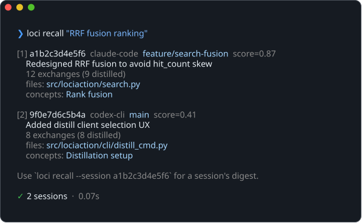
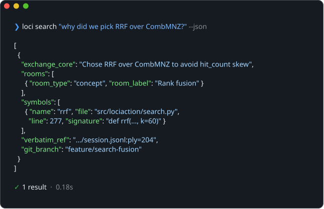
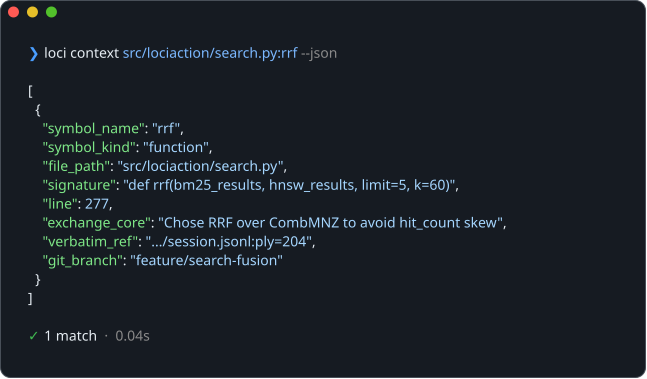
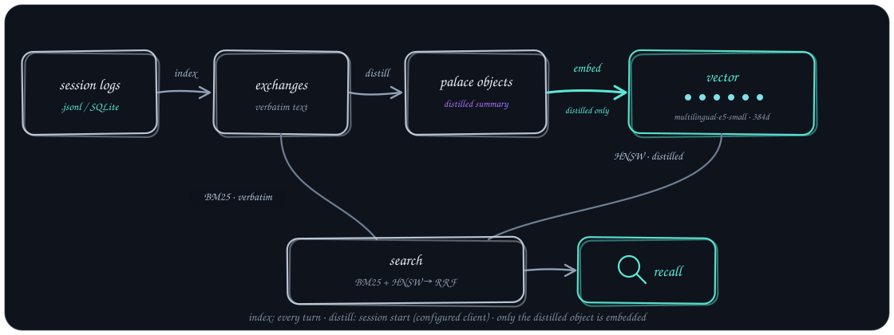

# Lociaction

<p align="center">
  <a href="https://github.com/senna-lang/lociaction/actions/workflows/ci.yml"></a>
  <a href="https://pypi.org/project/lociaction/"></a>
  <a href="LICENSE"></a>
</p>

**Give your coding agent code-aware and semantic recall.**

<p align="center">
  
</p>

Where most agent-memory tools rely on semantic search over stored text, Lociaction also indexes exact code location: tree-sitter resolves every touched file down to its function, class, or method, so a file, symbol, or line becomes a recall query on its own — not just a keyword. `loci search` layers semantic recall on top for when no code location is known yet. Because indexing happens at the session level, `loci recall` doubles as a built-in cross-harness resume: work captured across Claude Code, Codex CLI, Oh My Pi, OpenCode, and Grok lands in one project memory, browsable as a distilled summary first, with full session detail one `loci show` away.

After the embedding server's first load, warm `loci search` calls stay **under ~0.2 seconds**. Session distillation can also stay on-device with [`qwen2.5-7b-memory-distiller`](https://huggingface.co/sennaLLMLearner/qwen2.5-7b-memory-distiller), a purpose-built SLM fine-tuned specifically for session-memory distillation.

## Why Lociaction

- **Memory that writes itself** — Once installed, native lifecycle hooks index completed turns and prepare memory at session start. No manual notes to maintain.
- **Recall from the code you are looking at** — Point `loci context` at a file, symbol, or line for an exact hit; no exact match widens the search (same file → same directory → semantic) with a confidence score instead of failing silently.
- **Pick up work across harnesses** — `loci hook install --harness <name>` wires each harness into the same project memory, so `loci recall` can resume work regardless of which agent produced it.
- **Local when privacy matters** — Lociaction's index stays under `.lociaction/`. Select the fine-tuned local distiller to keep exchange text off cloud APIs.
- **Summaries with receipts** — Start with a distilled memory, then use `loci show` to retrieve the original exchange copied into the project-local index, along with its neighboring context.
- **Built for agents, not dashboards** — A small CLI surface and stable JSON output provide recall without keeping MCP tool schemas in the context window.

The name comes from the [Method of Loci](https://en.wikipedia.org/wiki/Method_of_loci), the memory-palace technique. Lociaction distills conversations into structured "palace objects"; see [How It Works](#how-it-works).

## Minimal Interface

The agent chooses among two recall primitives and one session browser:

- **`loci context <file>[:<symbol-or-line>]`** — start from the code currently being viewed or edited; branch lookup is also available with `--branch`
- **`loci search "query"`** — semantically recall relevant memories from past conversations
- **`loci recall ["query"]`** — browse the newest sessions or rank them by relevance; add `--session ID` for one session's digest

When the distilled result is not enough, `loci show "<exchange-id>"` retrieves the stored verbatim exchange. The intentionally small surface helps the agent choose correctly and avoids the context cost of resident MCP tool schemas.

<p align="center">
  
</p>

Running `loci context` for a symbol recalls what shaped it: the command resolves the exact code location and signature, then returns the conversations behind them.

<p align="center">
  
</p>

## How It Works

<p align="center">
  
</p>

1. **Index** — Splits agent session logs into exchanges (user utterance + agent response pairs) and indexes them with FTS5 for keyword search
2. **Distill** — The configured distill client (default `claude --print` with `claude-haiku-4-5`; see [Configuration](#configuration) for the other five CLI backends and local-model options) summarizes each exchange into a palace object: `exchange_core` (what was done), `specific_context` (concrete details), `room_assignments` (topic tags). tree-sitter resolves touched files to symbol level (function/class/method + file + line + signature)
3. **Search** — Cross-layer search fusing BM25 on verbatim text with HNSW on distilled embeddings via RRF

Raw conversations are not embedded — only the condensed distilled text is embedded with `multilingual-e5-small` (384-dim), balancing semantic search quality with embedding cost. The embedding model runs as a **Unix socket server**, so subsequent searches avoid model startup.

## Installation

```bash
pipx install lociaction
```

Requires Python 3.11+.

## Quick Start

```bash
# Initialize in project root. This creates `.lociaction/` and adds the shared
# agent reminder to AGENTS.md.
loci init
```

`loci init` creates the project-local database, indexes existing sessions from every detected harness with one threshold and history-distillation policy, writes the common `AGENTS.md` instruction section, and installs Claude Code hooks unless `--no-hooks` is supplied. Every other supported harness (Codex, Grok, Oh My Pi, OpenCode) also has full native lifecycle hook support — register it explicitly with `loci hook install --harness <name>`. If init fails partway through, `.lociaction/` is cleaned up automatically so re-running is safe.

When running `loci init`, if past session logs are detected, you'll be prompted with:

> [!IMPORTANT]
> When adopting this tool mid-project, a large number of exchanges may already exist. Distilling all of them consumes real tokens against whichever distill client you choose (Claude Haiku by default — see step 4 below for the other options). We recommend starting with `Skip all` or `Distill last 50`.

1. **Min chars threshold** — Minimum character filter applied at index time (default: 50). Shorter exchanges are skipped entirely, which also shrinks the pool of distillation candidates. Higher values exclude short conversations and reduce token usage; lower values include nearly everything. (Distillation applies a separate `min_chars` of 100 — see [Configuration](#configuration).)
2. **Handling existing exchanges** — Choose how much past history to distill:
   - Skip all (no past session distillation)
   - Distill last 50 (recent history only)
   - Distill all (everything — high token cost)
   - Custom (specify a number)
3. **Run distillation now?** — Accepts `1`/`2`/`y`/`n`/`yes`/`no`. Choose No to defer to the next session start.

`loci init` also asks once, regardless of past session history:

4. **Distill client selection** — If [`qwen2.5-7b-memory-distiller`](https://huggingface.co/sennaLLMLearner/qwen2.5-7b-memory-distiller) (a Qwen2.5-7B fine-tuned specifically for this task, SFT + ORPO on WildChat-1M) isn't pulled yet, `loci init` first offers to `ollama pull` it (~4.7GB, requires [Ollama](https://ollama.com) for the GGUF blob). It then lists every *Ready* distill client actually detected on the machine — `claude-cli`, `codex-cli`, `gemini-cli`, `grok-cli`, `opencode-cli`, `omp-cli`, plus `llamacpp-ft` — and prompts you to pick one (`llamacpp-ft` is recommended when `llama-server` is ready, otherwise the first Ready client). Only CLIs actually on `PATH` show up; none of this depends on which harness you're currently working in — see the [Configuration](#configuration) note on that. Pass `--no-local-distiller` to skip the Ollama pull offer, or `--distill-client <id>` to select non-interactively (exits with an error if that client isn't Ready — it never silently falls back to another one). If no client is Ready, distillation is left unconfigured; run `loci distill --setup` later.

Invalid input on any prompt re-prompts instead of silently falling back to a default.

## Agent Instructions

`loci init` installs the marker section (`<!-- BEGIN LOCIACTION -->...<!-- END LOCIACTION -->`) in **`AGENTS.md`**, the common instruction source for every supported harness. `loci prime` injects full command usage into a session context when native lifecycle support is available.

## CLI Commands

| Command | Description |
|---------|-------------|
| `loci docs list` / `loci docs show <name>` | Version-matched documentation shipped with this install (no project or network required) |
| `loci init [--distill-client ID]` | Initialize `.lociaction/`, write common `AGENTS.md` instructions, and install Claude hooks (`--no-hooks` to skip, `--no-local-distiller` to skip the Ollama pull offer, `--distill-client` to pick the distill client non-interactively) |
| `loci index [--harness all\|claude\|codex\|opencode\|omp-pi\|grok]` | Index new session logs; the default indexes every detected harness |
| `loci distill [--limit N] [--setup]` | Distill undistilled exchanges via the configured client; `--setup` re-runs discover/select and saves the choice |
| `loci gc` | Snapshot `memory.db` to `.bak`, remove only orphaned palace/vector/session records, retain the current backup plus three archives, then run `VACUUM` |
| `loci search "query" --json` | Semantic search (agent-facing); add `--branch NAME` to filter by git branch |
| `loci context --symbol "name" --json` | Code symbol → past conversations (lightweight; add `--full` for verbatim text) |
| `loci context --branch "name" --json` | Git branch → past conversations (includes undistilled exchanges) |
| `loci recall ["query"] [--session ID] --json` | Resume: session list (newest or relevance-ranked) or one session's digest; `--file`/`--branch` filter either mode |
| `loci show "<exchange-id>" --json` | Retrieve a stored exchange by its primary ID |
| `loci status` | Show index state |
| `loci prime` | Inject command usage into the session context |
| `loci server start/stop/status` | Embedding server management |
| `loci hook install --harness NAME` | Install native lifecycle hooks for one of the five supported harnesses |
| `loci hook uninstall --harness NAME` | Remove native lociaction lifecycle hooks |

Installed documentation is the source of truth for setup, recall, harnesses, distillation, troubleshooting, and privacy. Prefer `loci docs show <name>` over web pages so the text matches this exact version. The Markdown sources live in [`src/lociaction/docs/`](src/lociaction/docs/).


## Harness Lifecycle

| Harness | Transcript source | Native lifecycle |
|---------|-------------------|-------------------|
| Claude Code | Project JSONL | `~/.claude/settings.json` |
| Codex CLI | Global rollout JSONL filtered by recorded cwd | `~/.codex/hooks.json` |
| Grok | Project streaming JSONL | `~/.grok/hooks/lociaction.json` |
| Oh My Pi | Project JSONL | `~/.omp/agent/extensions/lociaction.ts` |
| OpenCode | Local session SQLite | `~/.config/opencode/plugins/lociaction.ts` |

Every supported harness has full native lifecycle integration — no fallback/manual-instructions path exists for any of these five. Turn end maps to `loci index`, session start to `loci server start` + `loci distill` + `loci prime`. Compact handling differs slightly: Claude Code and Codex CLI fold compact into the same session-start trio (their matcher includes `compact`); Grok and OpenCode run only `loci prime` on compact; Oh My Pi has no compact-equivalent event to hook into. `loci hook install/uninstall --harness NAME` manages any of these and never touches another harness's settings.

## Search Output

```json
[
  {
    "exchange_core": "Added connection pool with pool_size=5",
    "specific_context": "pool_size=5, max_overflow=10",
    "rooms": [
      { "room_type": "concept", "room_key": "db-pool", "room_label": "DB connection pooling" }
    ],
    "symbols": [
      { "name": "create_pool", "file": "src/db.py", "line": 42, "signature": "def create_pool(...)" }
    ],
    "verbatim_ref": "~/.claude/projects/.../session.jsonl:ply=42",
    "git_branch": "feature/db-pool"
  }
]
```

## Configuration

`.lociaction/config.toml` (generated by `loci init`):

```toml
[distill]
client = "claude-cli"                  # Distillation backend — see the full id list below
model = "claude-haiku-4-5-20251001"    # Model for distillation (client-specific default if omitted)
batch_limit = 20                       # Max distillations per hook run
min_chars = 100                        # Skip distillation for exchanges shorter than this

[index]
min_chars = 50                         # Skip indexing exchanges shorter than this
```

There are two `min_chars` settings: `[index] min_chars` controls what gets indexed at all, while `[distill] min_chars` further skips distillation (the LLM cost) for short exchanges that were already indexed.

`client` is independent of the harness you're actually working in — `loci distill` runs the one configured client against every undistilled exchange regardless of whether it came from Claude Code, Codex, Grok, OpenCode, or Oh My Pi (see [Harness Lifecycle](#harness-lifecycle)). Valid ids: `claude-cli`, `codex-cli`, `gemini-cli`, `grok-cli`, `opencode-cli`, `omp-cli`, `llamacpp-ft`, `openai-compat`. The legacy `provider = "claude" | "openai"` + `base_url` form is still read, but `client` is what `loci init` and `loci distill --setup` write and is the recommended way to configure this by hand too.

### Distilling with a local LLM

Distillation is a small per-exchange structured-extraction task, so a local model is usually good enough. Any OpenAI-compatible endpoint (Ollama, LM Studio, llama.cpp-server, vLLM) works by setting `client = "openai-compat"` with `model` and `base_url` — no new dependencies, no API key (the `Authorization` header is never sent, so this is local-only):

```toml
[distill]
client = "openai-compat"
model = "qwen2.5:7b"
base_url = "http://localhost:11434/v1"   # Ollama
# base_url = "http://localhost:1234/v1"  # LM Studio
```

`openai-compat` requires both `model` and `base_url` to be set — resolving fails otherwise. For the bundled fine-tuned GGUF, use `client = "llamacpp-ft"` (ephemeral `llama-server --model-draft`). Pointing `openai-compat` at Ollama's HTTP port is still valid if you want that transport.

`loci init` offers to set this up for you automatically with [`qwen2.5-7b-memory-distiller`](https://huggingface.co/sennaLLMLearner/qwen2.5-7b-memory-distiller), a model fine-tuned specifically for this task (see the prompt above) — no manual config needed if you accept it.

### Distilling with another coding-agent CLI

If you already have [Codex CLI](https://developers.openai.com/codex/cli), [Gemini CLI](https://github.com/google-gemini/gemini-cli), [Grok CLI](https://x.ai), [OpenCode](https://opencode.ai), or [Oh My Pi](https://github.com/can1357/oh-my-pi) installed and authenticated, any of them can run distillation instead of `claude --print` — no extra config beyond selecting the client:

```toml
[distill]
client = "codex-cli"     # or "gemini-cli", "grok-cli", "opencode-cli", "omp-cli"
# model = "gpt-5-codex"  # optional override; omit to use the CLI's own configured default
```

`codex exec --output-schema` and `grok -p --json-schema` constrain the response to the palace-object schema directly (`structuredOutput` unwraps in one step for grok, no wrapper at all for codex). `gemini --prompt --output-format json`, `opencode run --format json`, and `omp -p --mode json` have no schema-constrained mode, so the palace object is parsed out of their free-text/event-stream output the same way `claude --print`'s `result` field is unwrapped. `loci distill --setup` detects all five automatically (PATH presence only, like `claude-cli`) and lists them alongside the other ready clients.

Beyond `loci init` writing `client = "..."` to config.toml, a background hook (Claude Code's Stop/SessionStart, or any non-interactive `loci distill`) also requires the invoking user's own environment to grant it explicitly — a cloned repo's `.lociaction/config.toml` cannot silently opt you into sending session text to one of these CLIs:

```bash
export LOCIACTION_REMOTE_DISTILL_CLIENTS=omp-cli   # comma-separated for more than one
```

Set this in the shell profile the hook process actually inherits, not just an interactive terminal (GUI-launched agents on macOS often skip `~/.zshrc`/`~/.bashrc`). Interactively selecting a client during `loci init`/`loci distill --setup` still runs that same session's distillation regardless — the prompt itself is the consent; the grant only gates later, non-interactive runs. See `loci docs show distillation`.

## Acknowledgments

The palace object model, room-based topic grouping, and BM25+HNSW fusion search are based on:

> *Structured Distillation for Personalized Agent Memory*
> (arXiv:2603.13017)


## License

MIT
